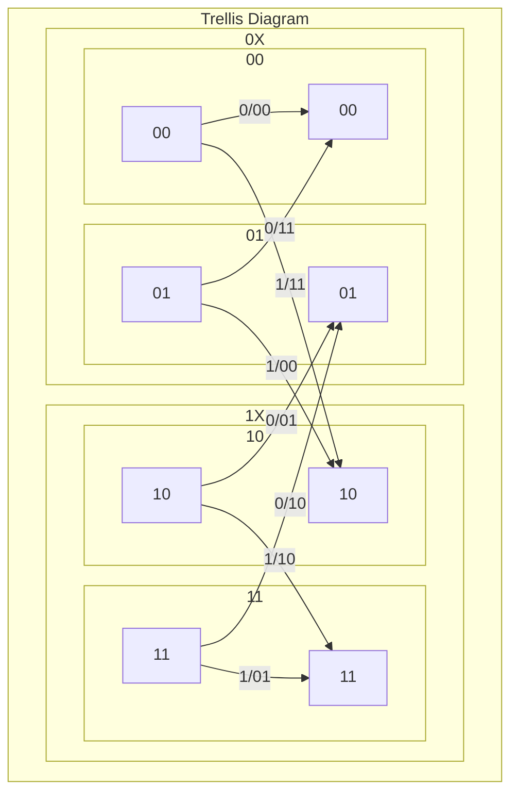

# Trellis

 - rate: 1/2
 - constraint: 3
 - Polynomials
   - 1, 0, 1
   - 1, 1, 1

## Table
| S0,1 | In | C0,1 | S'0,1 |
| ---- | -- | ---- | ----- |
| 0 0  | 0  | 0 0  | 0 0   |
|      | 1  | 1 1  | 1 0   |
| 0 1  | 0  | 1 1  | 0 0   |
|      | 1  | 0 0  | 1 0   |
| 1 0  | 0  | 0 1  | 0 1   |
|      | 1  | 1 0  | 1 1   |
| 1 1  | 0  | 1 0  | 0 1   |
|      | 1  | 0 1  | 1 1   |

